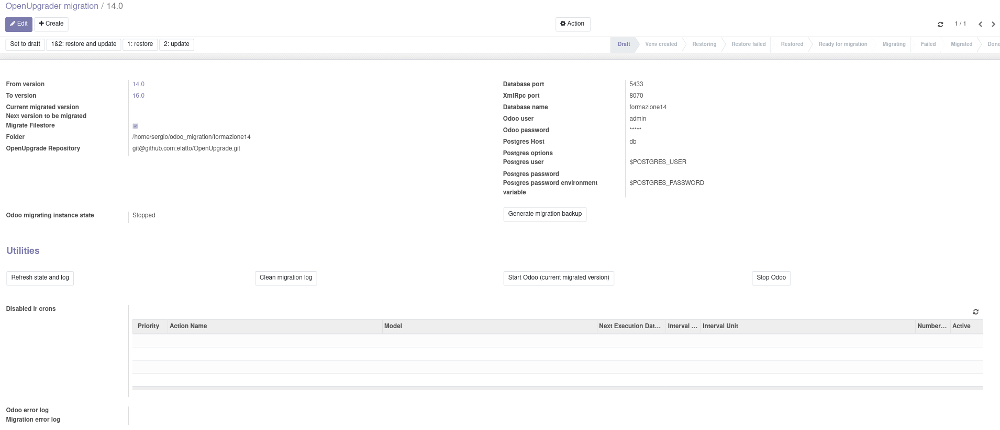
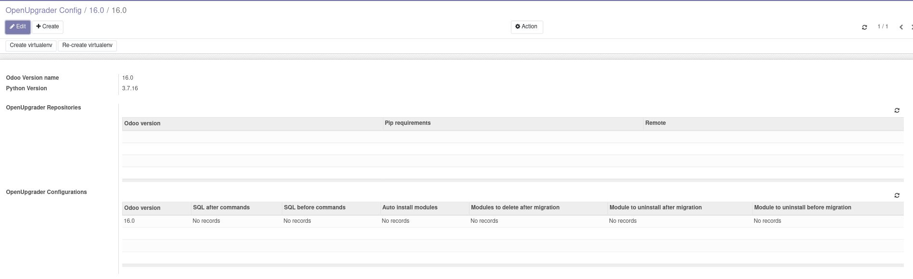

Menu for the module is in Configuration/Settings:

.. image:: ../static/description/menu.png
    :alt: Menu

The configuration is done in the main view:

Every version of Odoo included in the process must have its version and its virtualenv:

A virtualenv can be created with `Create virtualenv` or re-created cleaning entirely its folder with `Re-create virtualenv`.

Every version needs a configuration of action to do during the migration process:

.. image:: ../static/description/configuration.png
    :alt: Configuration

The migration process is usually done by:

#. Create Odoo version for every Odoo included in the migration process
#. Create Odoo configuration for every version (this process can be automated with two .yml files, see demo data)
#. Create the main configuration
#. Copy of the database and filestore in the virtualenv with the `Restore` button
#. Update of the copied database with the `Update` button
#. Prepare the migration with the extra configuration option with the `Prepare migration` button
#. Do the migration with the `Migrate` button
#. Repeat the `Prepare migration` and `Migrate` methods for every successive version

Notes:

#. Every instance of the migrated Odoo with virtualenv and log of the migration process is saved in configured folder or ~/odoo_migration/<database><version>/
#. If there are errors in the log of the Odoo migration it is shown in the main view
#. If the migration stops for some reasons, it can be corrected and retried with the `migrate` button, as normally in Odoo

This module works with some extra Debian packages, so tests are not possible now in the OCA container. A working docker instance example, with other packages not needed for this module, is here: https://github.com/kenayagi/docker-odoo/blob/14.0/Dockerfile

IMPROVEMENTS TODO: use queue_job to bypass limits of CPU times.
