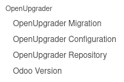
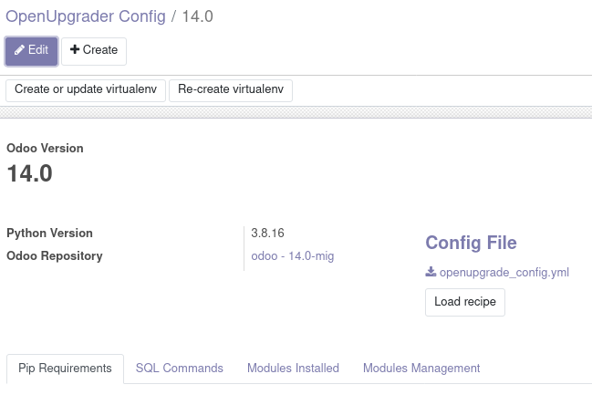
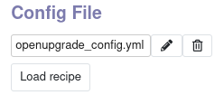
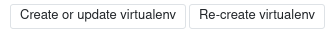
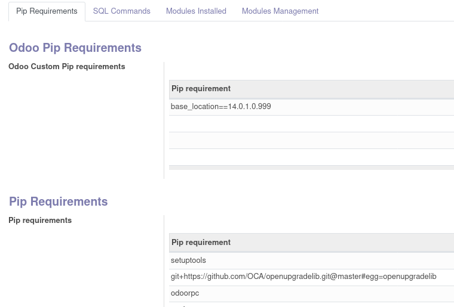
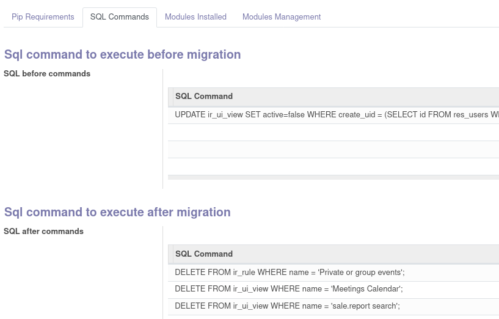
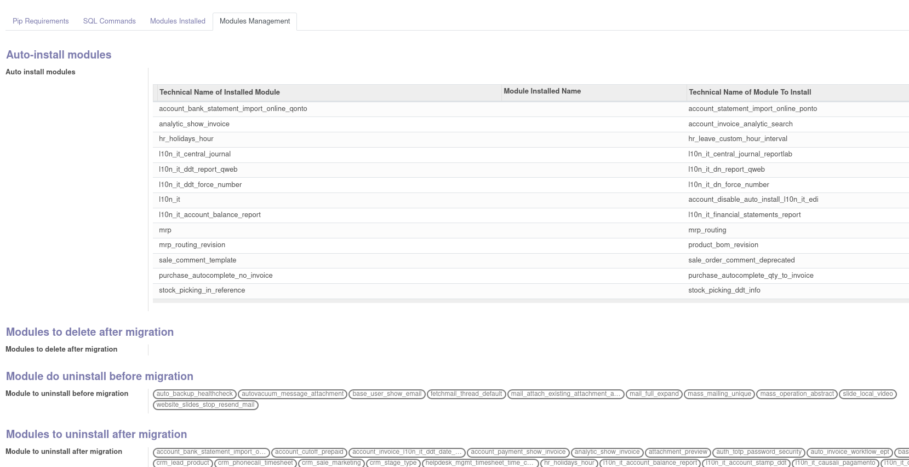
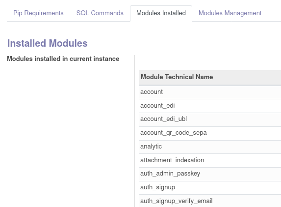

The menu is in Configuration/Settings:

Which provides two rows: the OpenUpgrader Migration is used to manage the migration process:

.. image:: ../static/description/migration.png
    :alt: Migration

The second row is the OpenUpgrader Configuration, which is used to configure specific parameters for every version of Odoo included in the process. So in a migration from 14.0 to 16.0, we need to create three configuration: 14.0, 15.0 and 16.0

This configuration can be imported by a yml file (see the tests folder for an example, the file can be filled with many versions of the configuration settings):

Every configuration must have a virtualenv, created with `Create virtualenv` (or re-created cleaning entirely its folder with `Re-create virtualenv`):

The configuration can be filled with these values:

* Pip Requirements: in this menu is possible to add some Odoo modules required for this version (in the form `<module_name><pip sign as ==, >=, >, etc><version>` and other normal pip modules:

* SQL commands: some command to be executed before of after the migration:

* Modules management: in this menu is possible to add module to be installed automatically, unistalled, or simply deleted:

* Installed modules: this menu is auto-computed at the creation of the configuration:

The migration process is as follows:

#. Create an OpenUpgrader Configuration for every version included in the migration process (this process can be automated with a yml file, see demo data)
#. Create the OpenUpgrader Migration with requested data of the database to migrate and the initial and target version of the migration
#. Use the `Restore` button to copy database and filestore in the virtualenv
#. Use the `Update` button to update copied database to current modules state
#. As an alternative to `Restore` and `Update` buttons, use `Restore and Update` button
#. Prepare the migration with the extra configuration option with the `Prepare migration` button
#. Do the migration with the `Migrate` button
#. Repeat the `Prepare migration` and `Migrate` methods for every successive version

Notes:

#. Every instance of the migrated Odoo with virtualenv and log of the migration process is saved in configured folder or ~/odoo_migration/<database>/
#. If the migration stops for some reasons, it can be corrected and retried with the `migrate` button, as normally in Odoo

POSSIBLE IMPROVEMENTS

#. Include migration for EE

* Download python method: curl -s https://upgrade.odoo.com/upgrade > odoo-upgrade.py
* Then migrate to the first available version (as the time of writing it is 16.0): python odoo-upgrade.py test --dump old.zip --target 16.0 --no-restore --contract MXXXXXXXX

#. If there are any errors in the log of the Odoo migration it is shown in the main view
